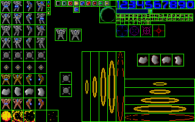

# mechs
Simple multidirectional shooter game originally created in July 2001 using [QuickBASIC](https://en.wikipedia.org/wiki/QuickBASIC) 4.5.


An [emulated version](https://lapets.io/mechs) can be played online.

## Source Code, Data, and Assets

The original QuickBASIC source, interface, and project files can be found in the directory `ORIGINAL`. This directory also includes data files and visual assets for the game.

  
*The pixel-based game sprite art was created using [MGI PhotoSuite 8.0](https://archive.org/details/mgi-photo-suitev-8-win-content-1997).*

## Build Requirements and Instructions

A straightforward way to compile the files found in the directory `ORIGINAL` is by running [QuickBASIC](https://en.wikipedia.org/wiki/QuickBASIC) 4.5 on [DOSBox](https://en.wikipedia.org/wiki/DOSBox). The below QuickBASIC 4.5 files are required but are not included in this repository. This build process has been tested with **DOSBox 0.74-3** and **QuickBASIC 4.50**.

* `BCOM45.LIB` (Version 4.50)
* `BRUN45.LIB` (Version 4.50)
* `LIB.EXE` (Version 3.14)
* `BC.EXE` (Version 4.50)
* `LINK.EXE` (Version 3.69)
* `QB.BI` (Version 4.50)

Assuming that the above are found within the directory `ORIGINAL`, the `MAKE.BAT` script can be used to build an executable called `MAIN.EXE`. **Note that the build script is case-sensitive**.
```shell
MAKE BUILD
```
The game can be played by running `MAIN.EXE`. The script can also be used to clear all files generated during the build process.
```shell
MAKE CLEAN
```

## Acknowledgments

This repository contains some source code snippets and library files obtained from third parties at the time the project was first authored. This section enumerates all known instances of such, but exact information about their origins may not be available at this time. Any additional information or suggestions about the below are welcome.

### Keyboard Handling Function

The `MULTIKEY` function found in `KEYBOARD.BAS` was originally authored by Milo Sedlacek and improved by Joe Huber, Jr. This function makes it possible to detect multiple simultaneous keyboard events. Copies of various versions of the function [can be found online](https://qbmikehawk.neocities.org/misc/MULTIKEY.TXT).

This function relies on the subroutine `ABSOLUTE` found in the file `QB.BI`. This file was usually provided by Microsoft with copies of QuickBASIC 4.5.

### GIF Loading Routine

The subroutines in `GRAPHICS.BAS` that load image and palette data from GIF files can be found in the 1996 book [*The Revolutionary Guide to QBasic*](https://openlibrary.org/books/OL1131718M/The_revolutionary_guide_to_QBasic) by Vladimir Dyakonov.

### Mode X Library

The below files (found in the directory `ORIGINAL`) are from a Mode X library for QuickBASIC that was found online at some point between 1998 and 2001. No information has been found so far about the authors or origins of this library.

* `MODEXLIB.BI`
* `MODEXLIB.LIB`
